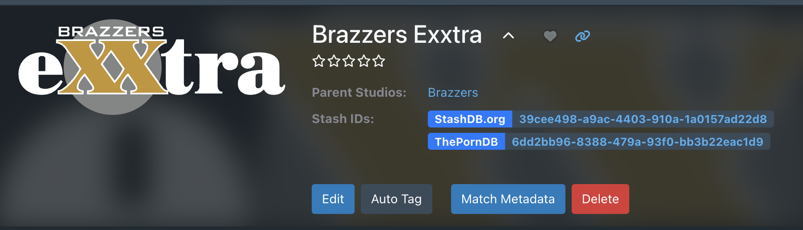
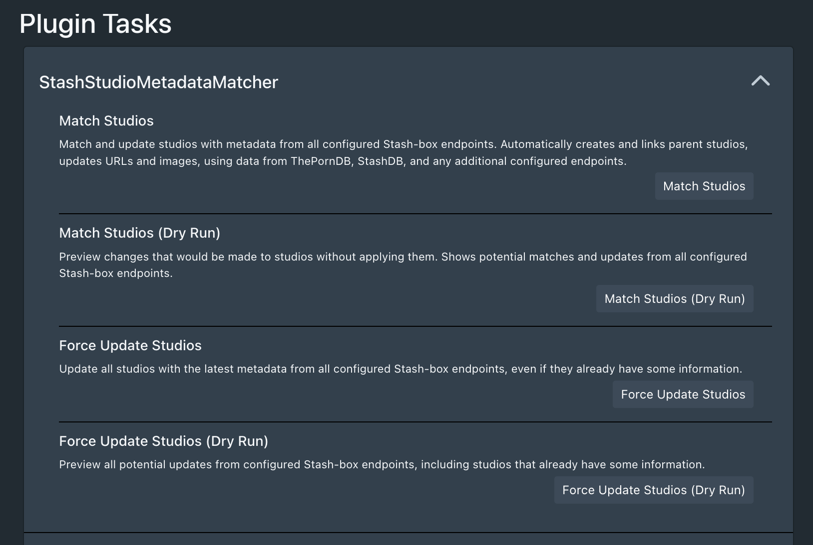

# StudioSync Plugin

A Stash plugin that completes missing studio information by matching and syncing with ThePornDB, StashDB, and other Stash-box endpoints. Automatically fills in missing IDs, URLs, images, and parent relationships. With both batch match options and single match with UI button.

## Features

- 🔄 **Multi-Endpoint Sync**: Works with ThePornDB, StashDB, and other Stash-box endpoints
- 👨‍👦 **Parent Studio Handling**: Automatically creates and links parent studios
- 🖼️ **Image Updates**: Automatically adds missing logos images for studios
- 🔍 **Intelligent Matching**: Fuzzy name matching for better results
- 🎯 **Flexible Updates**: Both batch processing and single studio updates

## Installation

1. Clone the repository to your Stash plugins directory:
   ```bash
   cd ~/.stash/plugins  # Adjust path according to your Stash installation
   git clone https://github.com/pedrolara-boop/StudioSync.git
   cd StudioSync
   ```

2. Install the Python requirements:
   ```bash
   pip install -r requirements.txt
   ```

3. Reload plugins in Stash (Settings > Plugins > Reload)

## Usage

### Single Studio Update

- Use the "Match Metadata" button on any studio page
- Updates just that studio with latest information

### Batch Updates


Available in Settings > Tasks:
1. **Match Studios**: Update all studios missing information
2. **Match Studios (Dry Run)**: Preview changes without applying them
3. **Force Update Studios**: Update all studios with latest data
4. **Force Update Studios (Dry Run)**: Preview all potential updates

## Requirements

- Python 3.6 or higher
- Python packages: requests, thefuzz, stashapi

## Support

- [Report Issues](https://github.com/pedrolara-boop/StudioSync/issues)
- [GitHub Repository](https://github.com/pedrolara-boop/StudioSync)

## License

MIT License - See LICENSE file for details 